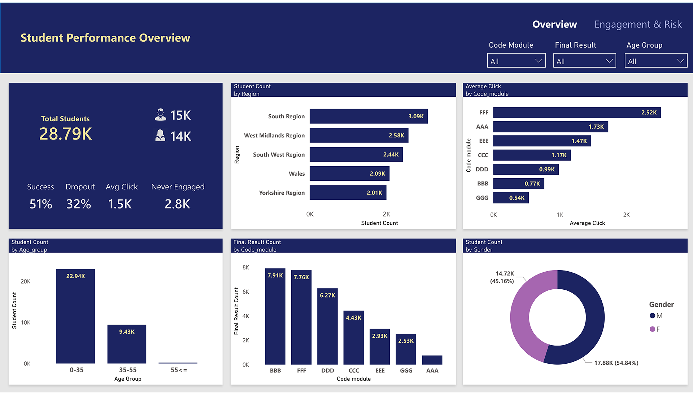
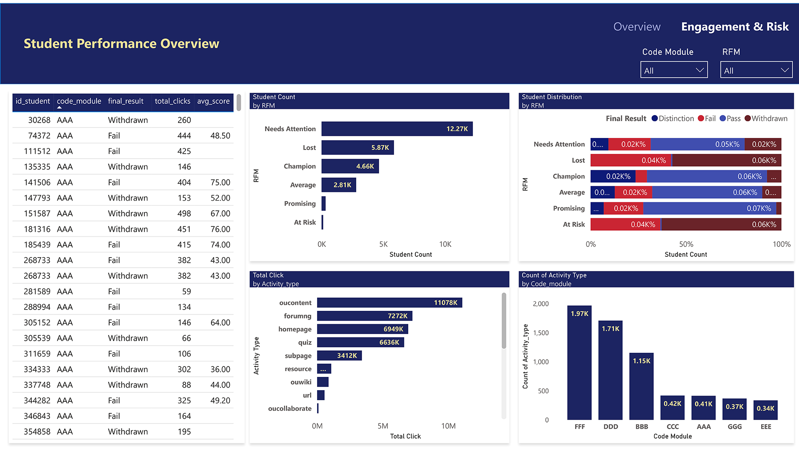

# OULAD Student Performance Analytics

An end-to-end data analytics project analyzing student engagement and performance using the Open University Learning Analytics Dataset (OULAD).

---

## Project Overview

This project analyzes 32,593 students across 7 courses to uncover engagement patterns, identify at-risk students, and provide actionable recommendations to improve student outcomes.

**Pipeline:**
```
Raw CSV Data → Python Cleaning → SQL Server Star Schema → SQL Queries → Power BI Dashboard → Insight Memo
```

---

## Tools & Technologies

- Python: 3.13.3              (Data cleaning and loading)
- Pandas: 2.2.3               (Data manipulation)
- SQLAlchemy: 2.0.41          (SQL Server connection)
- SQL Server: SSMS 21         (Queries)
- Power BI Desktop: latest    (Dashboard and KPIs)

---

## Dataset

**Source:** [Open University Learning Analytics Dataset (OULAD)](https://analyse.kmi.open.ac.uk/open-dataset)  

- 32,593 students
- 10.6M+ engagement records
- 7 courses
- Assessment, registration, VLE activity, and demographic data

> Raw data files are not included in this repository due to size. Download from the links above and place in `data/oulad/` folder.

---

## Project Structure

```
OULAD-Analytics/
│
├── data/
│   ├── oulad/          ← place raw CSVs here (not uploaded)
│   └── cleaned/        ← generated by notebook 1 (not uploaded)
│
├── notebooks/
│   ├── OULAD_01_cleaning.ipynb     ← data cleaning
│   └── OULAD_02_sql_load.ipynb     ← star schema + SQL load
│
├── sql/
│   ├── queries.sql         ← 9 analytical SQL queries
│   └── views.sql           ← vw_rfm, vw_rfm_result, vw_student_performance
│
├── dashboard/
│   ├── OULAD_dashboard.pbix
│   ├── page1_overview.png
│   ├── page2_engagement.png
│   ├── schema.png
│   └── dashboard.pdf
│
├── memo/
│   └── OULAD_Insight_Memo.pdf    ← insight memo for Head of Product
|
├── README.md
└── requirements.txt
```

---

## Star Schema

```
                     dim_student
                          │
dim_vle ── fact_activity ─|
                          │
                  fact_assessment ── dim_assessment
                          │
                    dim_enrollment
                    dim_registration
                    dim_course
```
Star schema with:
- 2 fact tables: `fact_activity`, `fact_assessment`
- 6 dimension tables: `dim_student`, `dim_enrollment`, `dim_course `, `dim_assessment`, `dim_vle`, `dim_registration`
 
See [Schema](dashboard/schema.png)

---

## SQL Queries

Performed business-focused SQL analysis including:
- Pass/fail trends
- Engagement vs performance
- Dropout analysis
- Resource usage analysis
- RFM student segmentation
---

## Power BI Dashboard

### Page 1 — Student Performance Overview
- KPI cards: Total Students, Male, Female, Success Rate, Dropout Rate, Avg Clicks, Never Engaged
- Final results by course (stacked bar)
- Average engagement by course
- Demographics: gender, age band, region
  

### Page 2 — Engagement & Risk Analysis
- RFM student segments by final result (100% stacked bar)
- Most used resources by total clicks
- At risk students table
- Engagement by result group
  


---

## Key Findings

- Overall success rate: **51%**
- Students who never engaged: **2.8K**
- Largest RFM segment: **Needs Attention: 12.27k**
- Most used resource: **oucontent (11M clicks)**
- Engagement directly predicts outcome — Champions show highest pass rates

See [Insights Memo](memo/OULAD_Insight_Memo.pdf) for key findings summary.

---

## Setup Instructions

### 1. Install dependencies
```bash
pip install pandas sqlalchemy pyodbc
```

### 2. Download dataset
Download OULAD from UCI repository and place CSVs in `data/oulad/`

### 3. Run cleaning notebook
```
Open notebooks/OULAD_01_cleaning.ipynb
Run all cells
Cleaned files saved to data/cleaned/
```

### 4. Run SQL load notebook
```
Open notebooks/OULAD_02_sql_load.ipynb
Update connection string with your SQL Server details
Run all cells
```

### 5. Open dashboard
```
Open dashboard/OULAD_dashboard.pbix
Refresh data connection to your SQL Server
```

---

## Author

**Jyoti Prakash Sethy**  
[LinkedIn](https://www.linkedin.com/in/jyotiprakash8895/)
[Email](mailto:jyotiprakash8895@gmail.com)

---

## Acknowledgements

Dataset: Kuzilek J., Hlosta M., Zdrahal Z. (2017) Open University Learning Analytics Dataset
